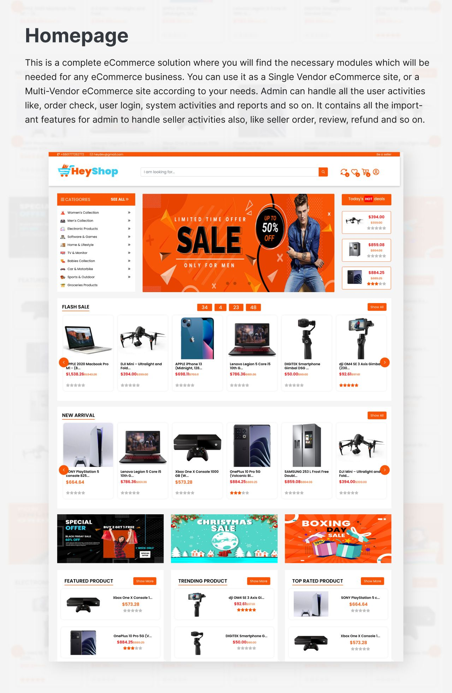
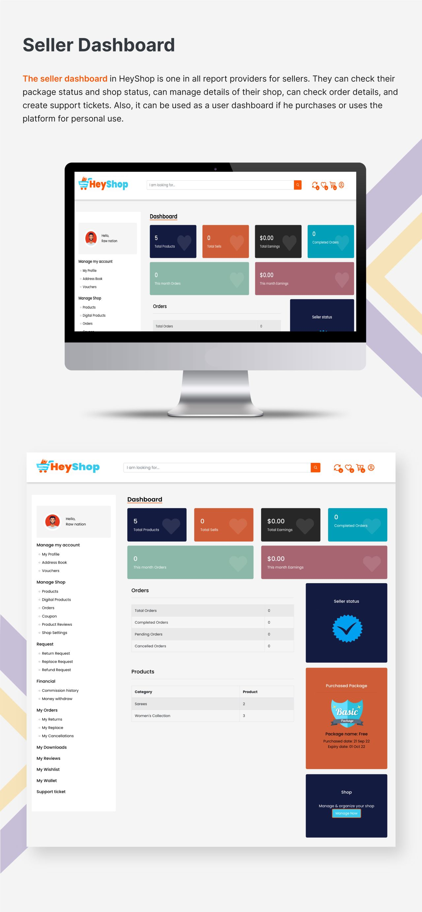
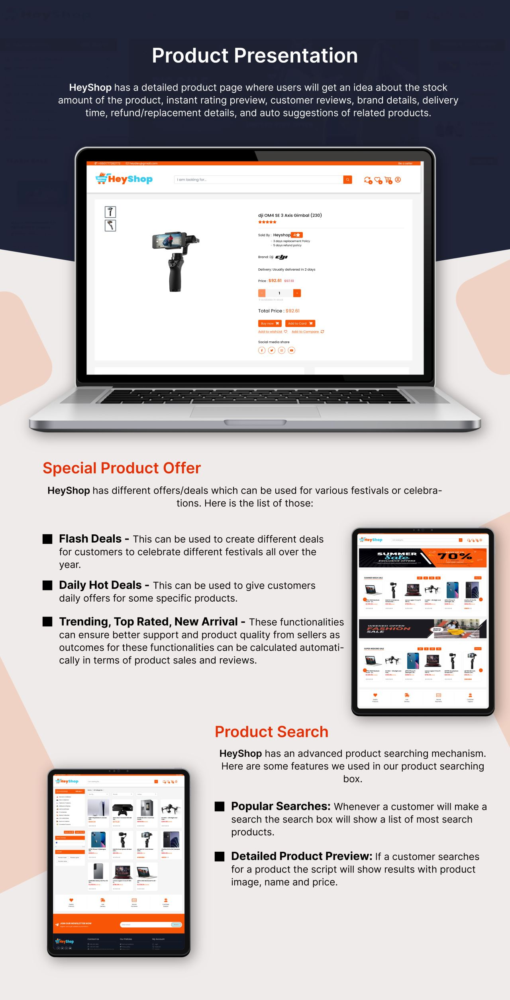
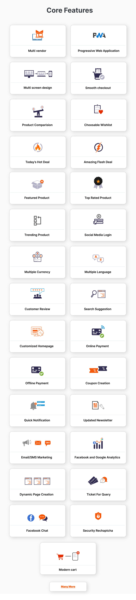
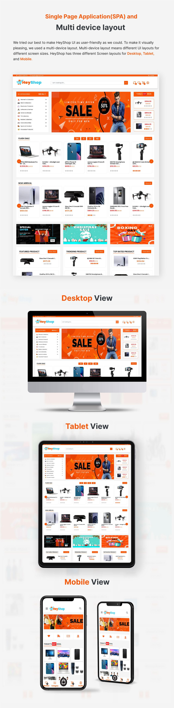

# 🛍️ HeyShop Frontend (Next.js)

HeyShop is a **scalable, multi-vendor e-commerce platform frontend** built using **Next.js and React**, designed to work seamlessly with a Laravel backend.

This frontend is fully **dynamic and backend-driven**, allowing complete UI customization without modifying frontend code.

---

## 🚀 Features

- 🛒 Product listing (Physical & Digital Products)
- ❤️ Wishlist & Add to Cart
- 💳 Checkout & Payment Integration (Stripe, PayPal)
- 🔐 Authentication (Login, Register, Social Login)
- 🧑‍💼 Multi-vendor marketplace UI
- 📦 Order tracking & history
- 🔁 Returns, Refunds & Replacement UI
- 🌍 Dynamic pages (CMS-driven)
- 🎯 Coupons, Flash Deals & Marketing UI
- ⭐ Product ratings & reviews
- 📱 Fully responsive design

---

## 🧠 Architecture

- Built with **Next.js (SSR + CSR hybrid)**
- Fully **API-driven architecture**
- Dynamic UI rendering based on backend configurations
- State management using **Redux & Thunk**
- Modular and scalable folder structure

---

## 🛠️ Tech Stack

- **Framework:** Next.js 13
- **UI Library:** React 18
- **State Management:** Redux, Redux Thunk
- **Styling:** Bootstrap, MUI, Emotion
- **API Calls:** Axios
- **Payments:** Stripe, PayPal
- **Forms & Validation:** Simple React Validator
- **SEO:** next-seo

## 📸 UI Preview

  
  

  
  

  

